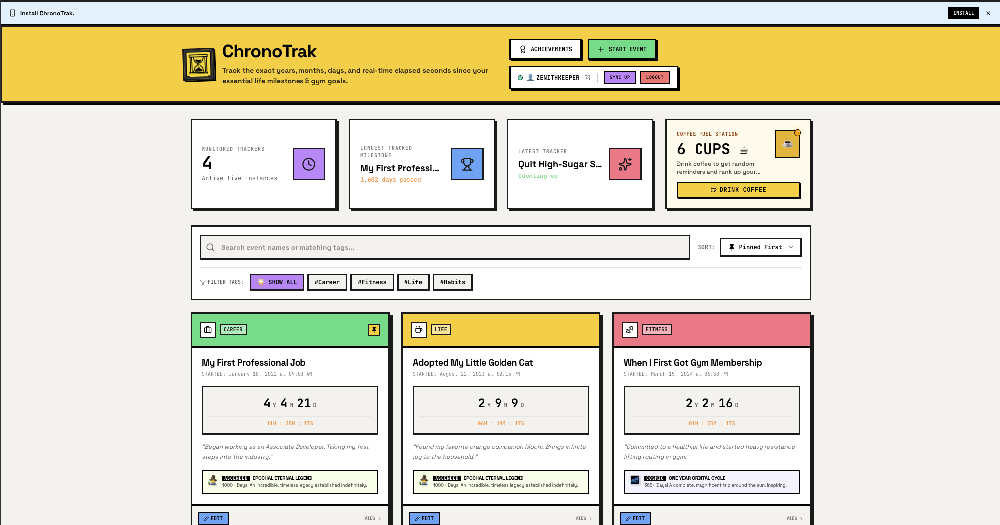
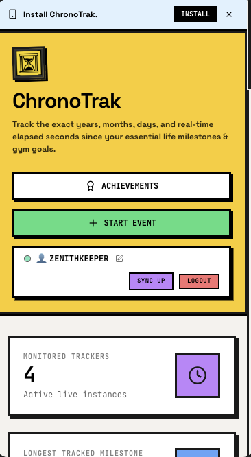

# ChronoTrak ⏱️

**ChronoTrak** is a high-contrast neobrutalist life milestone and lifestyle event tracker. It calculates exactly how much time has passed in years, months, days, hours, minutes, and real-time ticking seconds since your landmark achievements, goals, habits, and life events—featuring full persistent synchronization, offline-first security, and responsive layouts!

---

## 🎨 Visual Identity & Interface Previews

ChronoTrak is built with a bold, distinctive **neobrutalist retro design language**—featuring heavy black borders (`border-4 border-black`), solid offset drop shadows (`shadow-[4px_4px_0px_rgba(0,0,0,1)]`), premium typography pairings (**Inter** display paired with **JetBrains Mono** for live counters), and vibrant accent fills.

### 🌐 Desktop Dashboard View


### 📱 Responsive Mobile View

---

## 🚀 Key Features & Functionality

### ⏱️ 1. High-Precision Real-Time Tick engine
- Custom count-up counters show exact elapsed durations formatted in **Years, Months, Days (Y M D)** and ticking **Hours, Minutes, Seconds**.
- Supports selecting both past events (to track how long since something started) and future target times (to count down until a future date).
- Highly granular ticking increments to keep you connected with your goals.

### 🏆 2. Milestones, Achievements & Levels
- Tracks total monitored instances, longest running tracker, and latest trackers automatically.
- Integrates a **"Coffee Fuel Station" mini-interactivity**: rank up your caffeine stats and unlock interactive badges!
- Awards neobrutalist level achievements (e.g., *EPOCHAL ETERNAL LEGEND*, *ONE YEAR ORBITAL CYCLE*) dynamically as milestones persist.

### 📸 3. Interactive Photo Diary & Snapshots
- Attach visual snapshots and photo memories directly along your journey.
- Easily write accompanying textual journals with each snapshot.
- Compresses and stores snapshots seamlessly so they load lightning-fast.

### 📌 4. Sorting, Tagging & Priority Pinning
- Tag trackers by categories such as **Career**, **Life**, **Fitness**, and **Habits**.
- Seamlessly filter by custom tags or query tracker names instantly via the instant-search input.
- Keep critical life events pinned to the very top in an organized, responsive grid.

### 🗄️ 5. Real-Time Cloud Sync & Offline-First Persistence
- Fully integrated with **Firebase Firestore** and **Firebase Authentication** so trackers remain perfectly synchronized across your devices.
- Uses local storage backups gracefully to preserve offline-first capability and maintain instant startups.

---

## ⚙️ Setup & Local Installation

### Prerequisites
- [Node.js](https://nodejs.org/) (v18 or higher recommended)
- [npm](https://www.npmjs.com/)

### 🚀 Local Execution
1. Clone the repository or extract the ZIP file containing this project.
2. Install the lightweight project dependencies:
   ```bash
   npm install
   ```
3. Boot up the development server:
   ```bash
   npm run dev
   ```
4. Access the application on **`http://localhost:3000`** in your browser.

---

## 🔒 Security & Database Secrets

To connect to your own production Firestore database and authentication flow:
1. Copy `.env.example` to a new `.env` file in the root directory.
2. Provide your custom credentials for your Firebase account:
   ```env
   VITE_FIREBASE_API_KEY="your-api-key"
   VITE_FIREBASE_AUTH_DOMAIN="your-auth-domain"
   VITE_FIREBASE_PROJECT_ID="your-project-id"
   VITE_FIREBASE_STORAGE_BUCKET="your-storage-bucket"
   VITE_FIREBASE_MESSAGING_SENDER_ID="your-sender-id"
   VITE_FIREBASE_APP_ID="your-app-id"
   VITE_FIREBASE_MEASUREMENT_ID="your-measurement-id"
   VITE_FIREBASE_DATABASE_ID="(default)"
   ```

---

## ⚡ Tech Stack Architecture
- **Framework**: React 19 + TypeScript + Vite
- **Styling**: Tailwind CSS with custom theme token configurations
- **Animations**: `motion/react` (Framer Motion) for clean mechanical transitions
- **Database / Auth**: Cloud Firestore sync engine + Firebase Authentication client
- **Icons**: Lucide React vector suite
